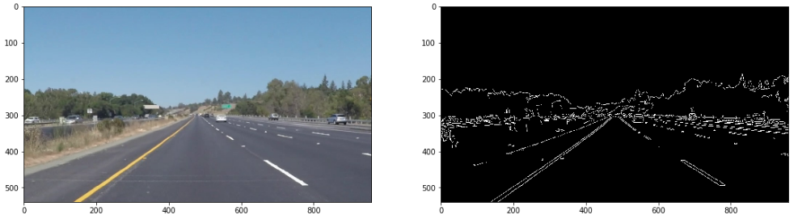
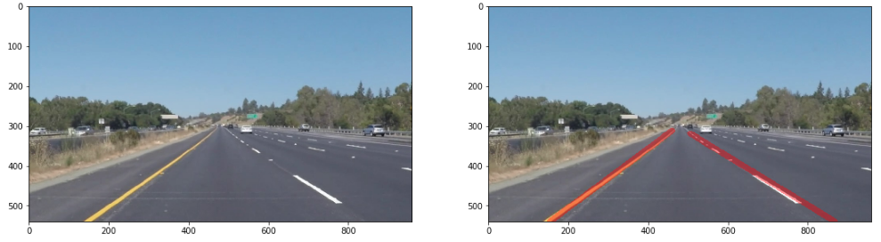
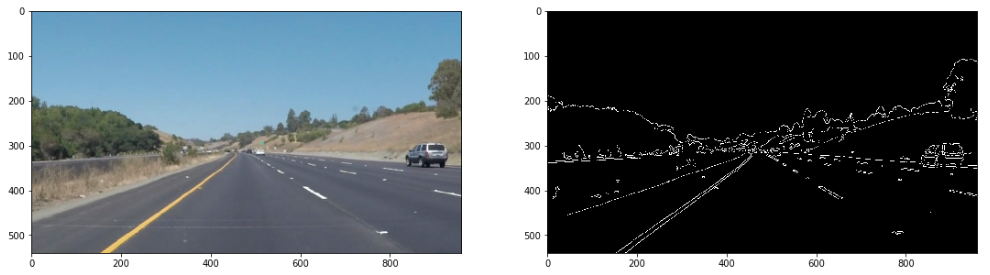
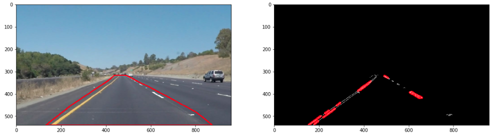
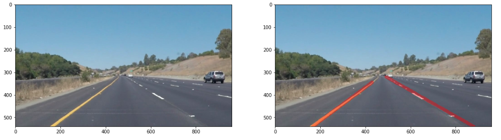
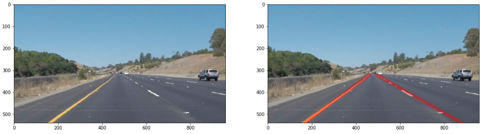
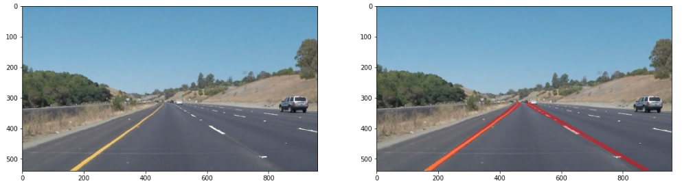
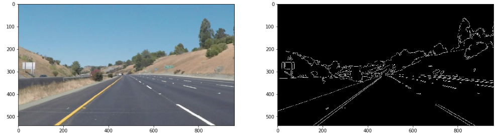
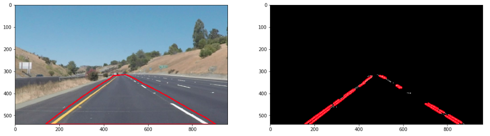
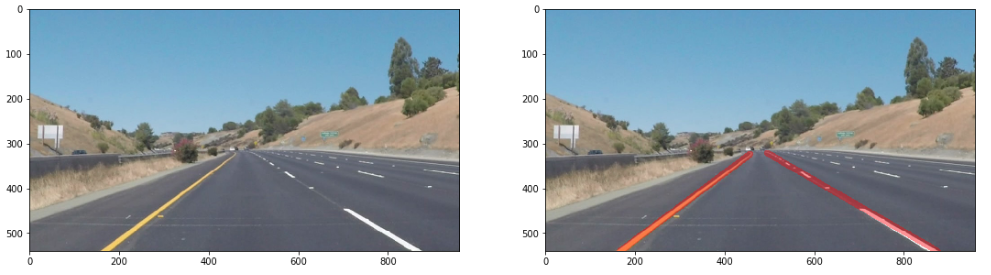

# **Self-Driving Car Engineer Nanodegree**
# **Project1: Finding Lane Lines on the Road**

## Madhav Karri

The goals/steps for this project are:
* Make a pipeline that finds lane lines on the road
* Reflect on your work in a written report

---

**Finding Lane Lines on Static Images/Frames**

Steps/process when working on Static Images/Frames
* Load all neceaary python imports
* Implement Gaussian Blur and Canny Edge Detection. For a single static image/frame fine tune parameters such as kernel size, low threshold and high threshold
* Followed by Masking and P-Hough Transform to extract lines and line-cordinates
* For the last step caculate slopes for all the line-coordinates from the previous step. Use the change in sign of slope values to segregrate lines and line-cordinates for each of the left and right lanes.
- To draw lines 
  - Average slope (parameter m) and intercept (parameter b) in "y=mx+b" for each of the left and right lane lines were determined.
  - The maximum y co-ordinate for all images (bottom) was determined to be 540 (from image size). Using this y-cordinate x-cordiantes for each of the left and right lanes were determined using the average "m" and "b" parameters.
  - For the minimum y co-ordinates (region of interest towards top of the image or near the top edge of the masking region) minimum from all the detected line-cordinates from P-Hough Transform for each of the left and right lanes were extracted. The x-cordiantes were determined using average "m" and "b" parameters.

The above set of steps were repeated on the following set of images
* solidWhiteRight.jpg
* solidWhiteCurve.jpg
* solidYellowLeft.jpg
* solidYellowCurve.jpg
* solidYellowCurve2.jpg
* whiteCarLaneSwitch.jpg

Results for solid-white-right:

Python Code/Implementation: [Link](CarND-LaneLines-P1/MadhavKarri-Project1-Files/solidWhiteRight-Copy1.ipynb)

* Gaussian Blur and Canny Edge Detection

* Masking and P-Hough Transform

* Final Output

Ideally white curve static-images and videos should have been implemented using color selection and region masking technique, which were introduced in the beginning of Term 1. Color selection/Region Masking likely would have been less computationally expensive compared to Gaussian Blur/Canny Edge Detection/Masking/P-Hough Transform. However, to retain consistency of python code and in lieu of time, implementation of lane detection on all static-images and videos have been performed using Gaussian Blur/Canny Edge Detection/Masking/P-Hough Transform.

Results for solid-white-curve:

Compared to solid-white-right, for the solid white curve the selection of masking area was modified.

Python Code/Implementation: [Link](CarND-LaneLines-P1/MadhavKarri-Project1-Files/solidWhiteCurve-Copy1.ipynb)

* Gaussian Blur and Canny Edge Detection

* Masking and P-Hough Transform

* Final Output

Results for solid-yellow-left:

Python Code/Implementation: [Link](CarND-LaneLines-P1/MadhavKarri-Project1-Files/solidYellowLeft-Copy1.ipynb)

* Gaussian Blur and Canny Edge Detection

* Masking and P-Hough Transform

* Final Output

Results for solid-yellow-curve:

Python Code/Implementation: [Link](CarND-LaneLines-P1/MadhavKarri-Project1-Files/solidYellowCurve-Copy1.ipynb)

* Gaussian Blur and Canny Edge Detection

* Masking and P-Hough Transform

* Final Output

- Final Output (Extrapolation/Patching left and right lanes to be equal at top end of the image)

- Technique 1: 
  - Determine visually the line that has the minimum y (in this case right lane). Use this minimum-y and "m" and "b" parameters of the left lane to extend/patch to be equal to the right lane.

- Technique 2: 
  - Determine x-difference as a function of y. 
  - Determine visually the line that has the minimum-y (in this case right lane). Use this minimum-y to determine x-difference. 
  - Add this x-difference to the x-(right lane) at minimum-y to determine x of left lane. 
  - This will extend/patch left lane to be equal to the right lane.

Results for solid-yellow-curve2:

Python Code/Implementation: [Link](CarND-LaneLines-P1/MadhavKarri-Project1-Files/solidYellowCurve2-Copy1.ipynb)

* Gaussian Blur and Canny Edge Detection

* Masking and P-Hough Transform

* Final Output

- Final Output (Extrapolation/Patching left and right lanes to be equal at top end of the image)
- Technique: 
  - Instead of using average "m" and "b" parameters for each of the left and right lanes. Localized "m" and "b" parameters are evaluated based on the extraction of lines and line-cordinates from Masking and P-Hough Transform.
  - Localized "m" and "b" parameters are evaluated in increments of 5 points in y-direction starting from bottom of the image (y=540) for each of the left and right lanes.
  - Unlike the previous extrapolation and patching techniques, this technique does not need visual inspection to determine the existence of minimum-y on left or right lanes. Instead the y-cordinates from all of the left and right lanes are pooled and the global minimum-y is determined.
  - A cobination of localized "m" and "b" parameters and the global minimum-y are used to draw a locus of continuous line segments for each of the left and right lanes

**Finding Lane Lines Inside a Video**

---

### Reflection

### 1. Describe your pipeline. As part of the description, explain how you modified the draw_lines() function.

My pipeline consisted of 5 steps. First, I converted the images to grayscale, then I .... 

In order to draw a single line on the left and right lanes, I modified the draw_lines() function by ...

If you'd like to include images to show how the pipeline works, here is how to include an image: 

### 2. Identify potential shortcomings with your current pipeline

One potential shortcoming would be what would happen when ... 

Another shortcoming could be ...

### 3. Suggest possible improvements to your pipeline

A possible improvement would be to ...

Another potential improvement could be to ...
