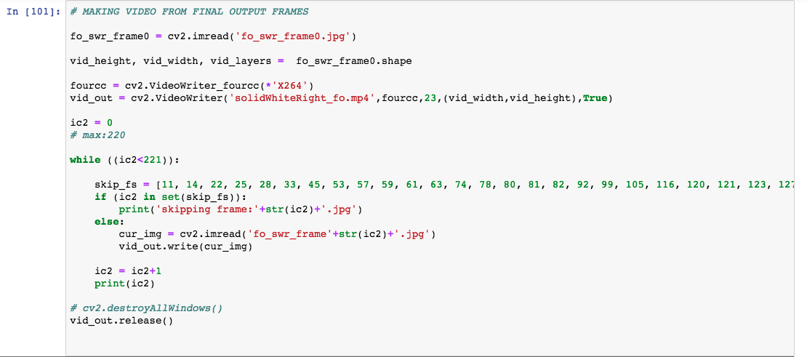

# **Self-Driving Car Engineer**
# **Project: Finding Lane Lines on the Road**

## MK

The goals/steps for this project are:
* Make a pipeline that finds lane lines on the road
* Reflect on your work in a written report

---

**Finding Lane Lines on Static Images/Frames**

Steps/process when working on Static Images/Frames
* Load all neceaary python imports
* Implement Gaussian Blur and Canny Edge Detection. For a single static image/frame fine tune parameters such as kernel size, low threshold and high threshold
* Followed by Masking and P-Hough Transform to extract lines and line-cordinates
* For the last step caculate slopes for all the line-coordinates from the previous step. Use the change in sign of slope values to segregrate lines and line-cordinates for each of the left and right lanes.
- To draw lines 
  - Average slope (parameter m) and intercept (parameter b) in "y=mx+b" for each of the left and right lane lines were determined.
  - The maximum y co-ordinate for all images (bottom) was determined to be 540 (from image size). Using this y-cordinate x-cordiantes for each of the left and right lanes were determined using the average "m" and "b" parameters.
  - For the minimum y co-ordinates (region of interest towards top of the image or near the top edge of the masking region) minimum from all the detected line-cordinates from P-Hough Transform for each of the left and right lanes were extracted. The x-cordiantes were determined using average "m" and "b" parameters.

The above set of steps were repeated on the following set of images
* solidWhiteRight.jpg
* solidWhiteCurve.jpg
* solidYellowLeft.jpg
* solidYellowCurve.jpg
* solidYellowCurve2.jpg
* whiteCarLaneSwitch.jpg

Results for solid-white-right:

Python Code/Implementation: [Link](./MadhavKarri-Project1-Files/solidWhiteRight-Copy1.ipynb)

* Gaussian Blur and Canny Edge Detection

* Masking and P-Hough Transform

* Final Output

Ideally white curve static-images and videos should have been implemented using color selection and region masking technique, which were introduced in the beginning of Term 1. Color selection/Region Masking likely would have been less computationally expensive compared to Gaussian Blur/Canny Edge Detection/Masking/P-Hough Transform. However, to retain consistency of python code and in lieu of time, implementation of lane detection on all static-images and videos have been performed using Gaussian Blur/Canny Edge Detection/Masking/P-Hough Transform.

Results for solid-white-curve:

Compared to solid-white-right, for the solid white curve the selection of masking area was modified.

Python Code/Implementation: [Link](./MadhavKarri-Project1-Files/solidWhiteCurve-Copy1.ipynb)

* Gaussian Blur and Canny Edge Detection

* Masking and P-Hough Transform

* Final Output

Results for solid-yellow-left:

Python Code/Implementation: [Link](./MadhavKarri-Project1-Files/solidYellowLeft-Copy1.ipynb)

* Gaussian Blur and Canny Edge Detection

* Masking and P-Hough Transform

* Final Output

Results for solid-yellow-curve:

Python Code/Implementation: [Link](./MadhavKarri-Project1-Files/solidYellowCurve-Copy1.ipynb)

* Gaussian Blur and Canny Edge Detection

* Masking and P-Hough Transform

* Final Output

- Final Output (Extrapolation/Patching left and right lanes to be equal at top end of the image)

- Technique 1: 
  - Determine visually the line that has the minimum y (in this case right lane). Use this minimum-y and "m" and "b" parameters of the left lane to extend/patch to be equal to the right lane

- Technique 2: 
  - Determine x-difference as a function of y
  - Determine visually the line that has the minimum-y (in this case right lane). Use this minimum-y to determine x-difference
  - Add this x-difference to the x-(right lane) at minimum-y to determine x of left lane.
  - This will extend/patch left lane to be equal to the right lane

Results for solid-yellow-curve2:

Python Code/Implementation: [Link](./MadhavKarri-Project1-Files/solidYellowCurve2-Copy1.ipynb)

* Gaussian Blur and Canny Edge Detection

* Masking and P-Hough Transform

* Final Output

- Final Output (Extrapolation/Patching left and right lanes to be equal at top end of the image)
- Technique: 
  - Instead of using average "m" and "b" parameters for each of the left and right lanes. Localized "m" and "b" parameters are evaluated based on the extraction of lines and line-cordinates from Masking and P-Hough Transform
  - Localized "m" and "b" parameters are evaluated in increments of 5 points in y-direction starting from bottom of the image (y=540) for each of the left and right lanes
  - Unlike the previous extrapolation and patching techniques, this technique does not need visual inspection to determine the existence of minimum-y on left or right lanes. Instead the y-cordinates from all of the left and right lanes are pooled and the global minimum-y is determined
  - A cobination of localized "m" and "b" parameters and the global minimum-y are used to draw a locus of continuous line segments for each of the left and right lanes

**Finding Lane Lines in a Video**

- Following are the pipeline/steps implemented for finding lane lines in a video
  - Implemented a python code to extract raw fraemes/static images from a video file

  - Implemented a pipeline consisting primarily of 1 main function and 3 call-back function definitions:
    - Function1: "my_ced" that implements Canny Edge Detection 
      - Input: ".jpg" image file
      - Output: edges from the Canny Edge Detection algorithm
    - Function2: "my_mpht" that implements Masking and P-Hough Transform to get line and line-coordinates.
      - Input: ".jpg" image file, masking coordiantes, and edges output from ("my_ced") Canny Edge Detection algorithm
      - Output: co-ordinates for all the lines detected by P-Hough Transform and consequently "m-slope" and "b-intercept" parameters
    - Function3: "my_fld" that implements drawing final lines and adding transperency
      - Input: ".jpg" image file and co-ordinates of all the lines detected by P-Hough Transform
      - Output: Original raw image/frame overlayed with detected/predicted lane lines
      - Extras: In addition this function also adds trasparency and saves the final output as a ".jpg file"
    - Main Function/Wrapper: A while loop that calls Functions 1, 2, 3 repeatedly on each of the image frames extracted from the original video.

  - Implemented a python code to stich final output frames from the preceeding steps and convert it into a video

**Final Video Output**

 - Solid White Right
   - Python Code/Implementation: [Link](./MadhavKarri-Project1-Files/Porject1Video-SolidWhiteRight/solidWhiteRight-mp4.ipynb)
   - Video Output File: [Link](./Writeup_IV/solidWhiteRight_fo.mp4)

  - Solid Yellow Left
    - Python Code/Implementation: [Link](./MadhavKarri-Project1-Files/Porject1Video-SolidWhiteRight/solidYellowLeft-mp4.ipynb)
    - Video Output File: [Link](./Writeup_IV/solidYellowLeft_fo.mp4) 
      
---

### Reflection

### Potential shortcomings with the current pipeline
- A lot of manual processing is involved with the exisiting pipeline.
  - Manual picking of masking co-ordinates
  - Fine tuning parameters for each of the Gaussian Blur/Canny Edge Detection/Masking/P-Hough Transform steps, specifically on each individual frames
  - Spurious or unwanted slopes, when segregating slopes to detect line segments associated with each of the left and right lanes

### Possible improvements to pipeline
- Research/Implement detection of arc/curvature line segments available in opencv
- Automate the process either through Machine Learning/AI for the following set of tasks
  - To pick optimal co-ordinates for masking
  - To reject spurious or unwanted slopes during slope segregation to identiyf left and right lanes
- Using mapping and localization explore possibility to detect and utilize priori information on lane coordinates and curvature
- Currently in the videos the lane detection lines are bumpy. The bumpiness can be minimized by adding weights during averaging of slopes. 

### Optional Challange
- Code that produced SolidYellowLeft.mp4 was attempted to detect lane lines. Although, it performed well on a good number of frames, it had issues detecting lane lines over the bridge.
- Tried modifying different parameters and found out converting the original raw image/frame using color space conversion code to hsv within cv2.cvtcolor resulted in optimal detection of the yellow and white lanes through all the frames in the video
- Solid Yellow Left
  - Python Code/Implementation: [Link](./MadhavKarri-Project1-Files/Porject1Video-Challenge/Challenge-mp4.ipynb)
  - Video Output File: [Link](./Writeup_IV/Challenge_fo.mp4)
