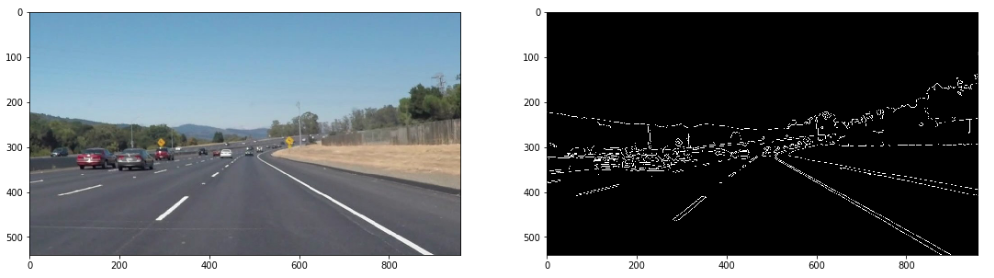

# **Self-Driving Car Engineer Nanodegree**
# **Project1: Finding Lane Lines on the Road**

## Madhav Karri

---

**Finding Lane Lines on Static Images/Frames**

Steps/process when working on Static Images/Frames
* Load all neceaary python imports
* Implement Gaussian Blur and Canny Edge Detection. For a single static image/frame fine tune parameters such as kernel size, low threshold and high threshold
* Followed by Masking and P-Hough Transform to extract lines and line-cordinates
* For the last step caculate slopes for all the line-coordinates from the previous step. Use the change in sign of slope values to segregrate lines and line-cordinates for each of the left and right lanes

The above set of steps were repeated on the following set of images
* solidWhiteRight.jpg
* solidWhiteCurve.jpg
* solidYellowLeft.jpg
* solidYellowCurve.jpg
* solidYellowCurve2.jpg
* whiteCarLaneSwitch.jpg

Results for solid-white-right:

Python Code/Implementation: [Link](CarND-LaneLines-P1/MadhavKarri-Project1-Files/solidWhiteRight-Copy1.ipynb) 
* Gaussian Blur and Canny Edge Detection

* Masking and P-Hough Transform

* Final Output

Ideally white curve static-images and videos should have been implemented using color selection and region masking technique, which were introduced in the beginning of Term 1. Color selection/Region Masking likely would have been less computationally expensive compared to Gaussian Blur/Canny Edge Detection/Masking/P-Hough Transform. However, to retain consistency of python code and in lieu of time, implementation of lane detection on all static-images and videos have been performed using Gaussian Blur/Canny Edge Detection/Masking/P-Hough Transform.

Results for solid-white-curve:
* Gaussian Blur and Canny Edge Detection

* Masking and P-Hough Transform

* Final Output

**Finding Lane Lines Inside a Video**

The goals / steps of this project are the following:
* Make a pipeline that finds lane lines on the road
* Reflect on your work in a written report

---

### Reflection

### 1. Describe your pipeline. As part of the description, explain how you modified the draw_lines() function.

My pipeline consisted of 5 steps. First, I converted the images to grayscale, then I .... 

In order to draw a single line on the left and right lanes, I modified the draw_lines() function by ...

If you'd like to include images to show how the pipeline works, here is how to include an image: 

### 2. Identify potential shortcomings with your current pipeline

One potential shortcoming would be what would happen when ... 

Another shortcoming could be ...

### 3. Suggest possible improvements to your pipeline

A possible improvement would be to ...

Another potential improvement could be to ...
