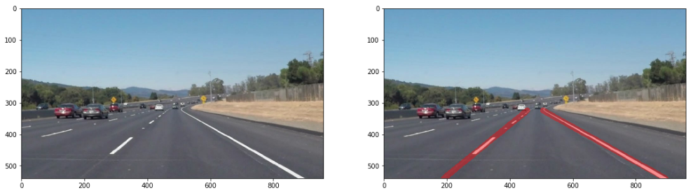

# **Self-Driving Car**
# **Project: Finding Lane Lines on the Road**

## MK

**Overview**

Detect highway lane lines in images using Python and OpenCV, a package that has many useful tools for analyzing images.

The goals/steps for this project: build a pipeline that finds lane lines on the road

**Finding Lane Lines on Static Images/Frames**

Steps/process when working on Static Images/Frames
* Load all necessary python imports
* Implement Gaussian Blur and Canny Edge Detection. Fine tune parameters such as kernel size, low threshold and high threshold
* Followed by Masking and P-Hough Transform to extract lines and line-coordinates
* Calculate weighted-average slopes for all line-coordinates from the previous step. Use the change in sign of slope values to segregate lines and line-coordinates for each of the left and right lanes.
* To draw lines 
  - Slope (parameter m) and intercept (parameter b) in "y=mx+b" for each of the left and right lane lines were determined
  - The maximum y-coordinate for all images (bottom) was determined to be 540 (from image size)
  - The minimum y-coordinate for all images was  fixed approximately at 0.6*(540)
  - Using these y-coordinates, corresponding x-coordinates for each of the left and right lanes were determined using "m" and "b" parameters

The above set of steps were repeated on the following set of test images


Results for solid-white-curve:

Python Code/Implementation: [Link](./MadhavKarri-Project1-Files/solidWhiteCurve.ipynb)

* Gaussian Blur and Canny Edge Detection

* Masking and P-Hough Transform

* Final Output


**Finding Lane Lines in a Video**

- Below pipeline implemented for finding lane lines in a video:
  - Implemented a python code to extract raw frames/static images from a video file
  
```python

# CAPTURE/EXTRACT STATIC FRAMES FROM VIDEO

#doing all the relevant imports
import matplotlib.pyplot as plt
import matplotlib.image as mpimg
import numpy as np
import cv2
import itertools as it

from collections import deque

print(cv2.__version__)
vidcap = cv2.VideoCapture('solidWhiteRight-Copy1.mp4')
success,image = vidcap.read()
count = 0
success = True
while success:
  cv2.imwrite("swr_frame%d.jpg" % count, image)     # save frame as JPEG file
  success,image = vidcap.read()
  print('Read a new frame: ', success)
  count += 1

```

  - Implemented a pipeline consisting primarily of 1 main function and 3 call-back functions:
    - Function1: "my_ced" that implements Canny Edge Detection 
      - Input: ".jpg" image file
      - Output: edges from the Canny Edge Detection algorithm
    - Function2: "my_mpht" that implements Masking and P-Hough Transform to get line and line-coordinates.
      - Input: ".jpg" image file, masking coordinates, and edges output from ("my_ced") Canny Edge Detection algorithm
      - Output: co-ordinates for all the lines detected by P-Hough Transform and consequently "m-slope" and "b-intercept" parameters
    - Function3: "my_fld" that implements drawing final lines and adding transperency
      - Input: ".jpg" image file and co-ordinates of all the lines detected by P-Hough Transform
      - Output: Original raw image/frame overlayed with detected/predicted lane lines
      - Extras: In addition this function also adds trasparency and saves the final output as a ".jpg file"
    - Main Function/Wrapper: A while loop that calls Functions 1, 2, 3 repeatedly on each of the image frames extracted from the original video.

  - Implemented a python code to stich final output frames from the preceeding steps and convert it into a video


**Final Video Output**

 - Solid White Right
   - Python Code/Implementation: [Link](./MadhavKarri-Project1-Files/Porject1Video-SolidWhiteRight/solidWhiteRight-mp4.ipynb)
   - Video Output File: [Link](./Writeup_IV/solidWhiteRight_fo.mp4)

  - Solid Yellow Left
    - Python Code/Implementation: [Link](./MadhavKarri-Project1-Files/Porject1Video-SolidWhiteRight/solidYellowLeft-mp4.ipynb)
    - Video Output File: [Link](./Writeup_IV/solidYellowLeft_fo.mp4) 
      
---

### Reflection

### Potential shortcomings with the current pipeline
- A lot of manual processing is involved with the exisiting pipeline.
  - Manual picking of masking co-ordinates
  - Fine tuning parameters for each of the Gaussian Blur/Canny Edge Detection/Masking/P-Hough Transform steps, specifically on each individual frames
  - Spurious or unwanted slopes, when segregating slopes to detect line segments associated with each of the left and right lanes

### Possible improvements to pipeline
- Research/Implement detection of arc/curvature line segments available in opencv
- Automate the process either through Machine Learning/AI for the following set of tasks
  - To pick optimal co-ordinates for masking
  - To reject spurious or unwanted slopes during slope segregation to identiyf left and right lanes
- Using mapping and localization explore possibility to detect and utilize priori information on lane coordinates and curvature
- Currently in the videos the lane detection lines are bumpy. The bumpiness can be minimized by adding weights during averaging of slopes. 

### Optional Challange
- Code that produced SolidYellowLeft.mp4 was attempted to detect lane lines. Although, it performed well on a good number of frames, it had issues detecting lane lines over the bridge.
- Tried modifying different parameters and found out converting the original raw image/frame using color space conversion code to hsv within cv2.cvtcolor resulted in optimal detection of the yellow and white lanes through all the frames in the video
- Solid Yellow Left
  - Python Code/Implementation: [Link](./MadhavKarri-Project1-Files/Porject1Video-Challenge/Challenge-mp4.ipynb)
  - Video Output File: [Link](./Writeup_IV/Challenge_fo.mp4)
